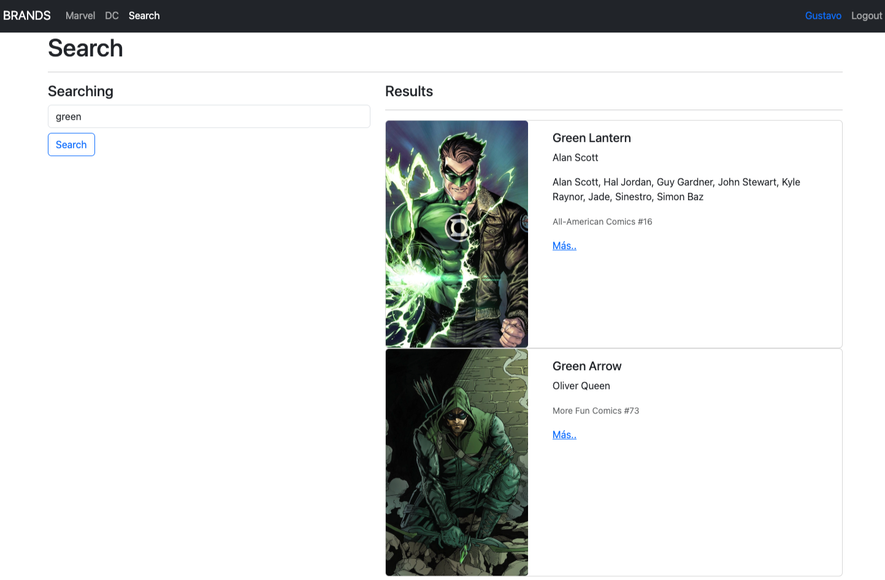
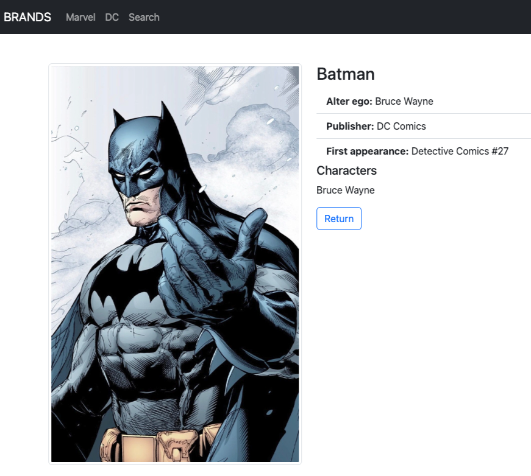
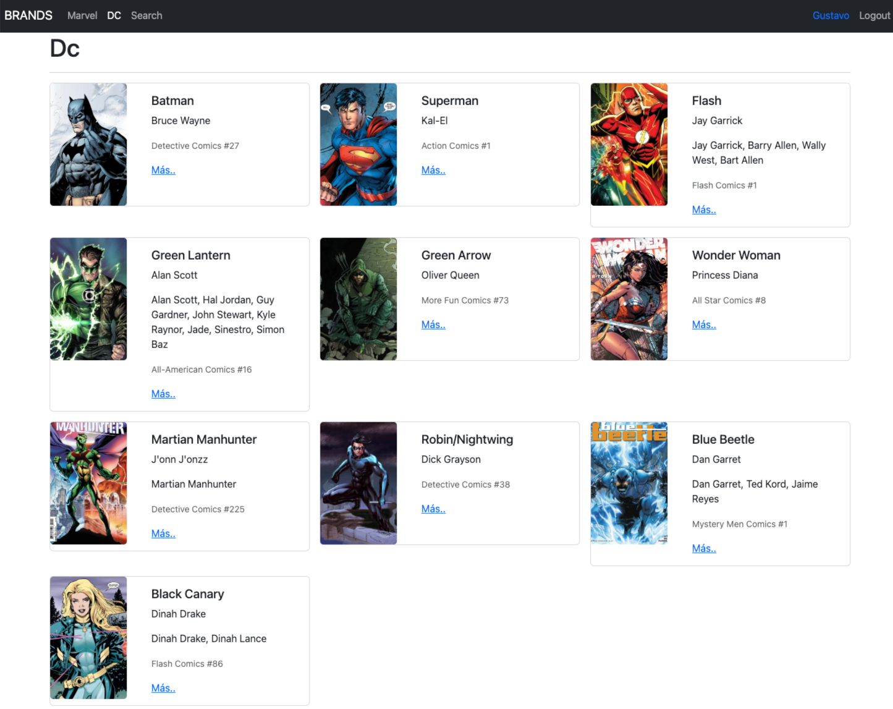
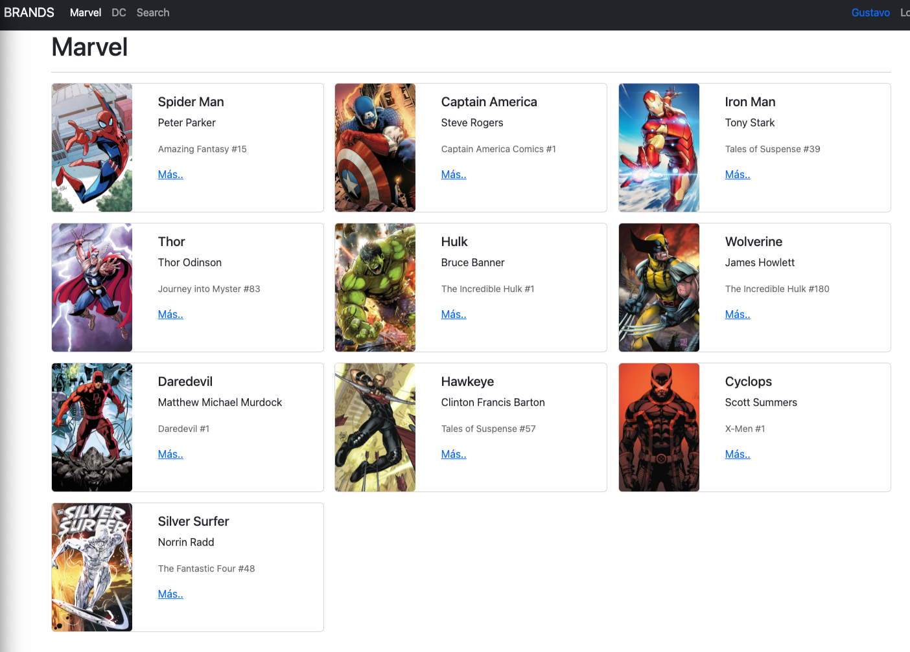

# Heroes SPA

This project is a single-page application (SPA) built with React and Vite. It allows you to search and view heroes from DC Comics and Marvel Comics.

## Features

- Search for heroes by name.
- View details of each hero.
- Navigate between different sections (DC, Marvel, Search).

## Installation

1. Clone the repository:
    ```sh
    git clone https://github.com/inerhead/heroes-SPA.git
    ```
2. Navigate to the project directory:
    ```sh
    cd heroes-SPA
    ```
3. Install the dependencies:
    ```sh
    yarn
    ```
4. Start the application in development mode:
    ```sh
    yarn dev
    ```

## Usage

### Hero Search

In the search section, you can search for heroes by name. Simply type the hero's name in the search field and press the "Search" button.



### Hero Details

Clicking on a hero will display the hero's details, including their alter ego, first appearance, and related characters.



### DC and Marvel Sections

You can navigate between the DC Comics and Marvel Comics sections to see a list of heroes from each publisher.



